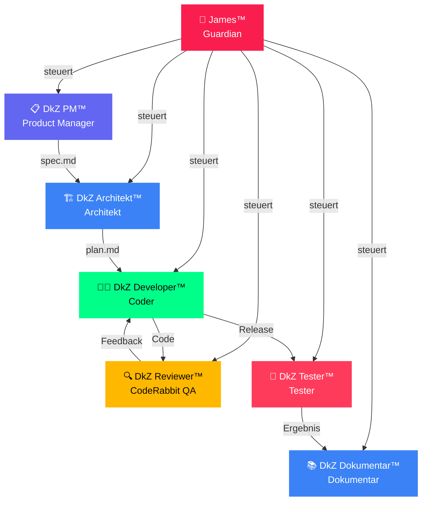
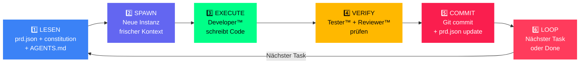

<div align="center">

# 🤖 BMAD™ Framework

### **B**lueprint → **M**apping → **A**nalyse → **D**esign

*Die 7-Agenten KI-Methodik von DEVKiTZ™ — Systematische Softwareentwicklung mit autonomen Spezialisten*

---


</div>

---

## 📖 Überblick

**BMAD™** ist die proprietäre Multi-Agenten-Methodik von [DEVKiTZ™](https://github.com/D-VKITZ), die Softwareentwicklung in vier strategische Phasen gliedert und durch sieben spezialisierte KI-Agenten autonom ausführen lässt. Jeder Agent hat eine klar definierte Rolle — vom strategischen Guardian bis zum Code-Executor — und operiert innerhalb des **Ralph-Loop™**, einem 6-Phasen-Zyklus, der kontextfrischen, fehlerfreien Output garantiert.

> **Kernprinzip:** Jeder Task bekommt frischen Kontext — kein Context Drift. Kein Agent arbeitet außerhalb seiner Rolle. James™ überwacht alles.

### 🧬 Was bedeutet BMAD?

| Phase | Name | Beschreibung |
|:------|:-----|:-------------|
| **B** | 🔵 Blueprint | Anforderungen erfassen, PRD erstellen, Ziele definieren |
| **M** | 🟣 Mapping | Architektur entwerfen, Module planen, Abhängigkeiten kartieren |
| **A** | 🟡 Analyse | Code-Review, Qualitätsprüfung, Testing, Metriken erheben |
| **D** | 🔴 Design | Implementation, Dokumentation, Deployment, Übergabe |

---

## 🤖 Die 7 Agenten

Das Herz von BMAD™ sind sieben spezialisierte Agenten, die im Zusammenspiel den gesamten Entwicklungszyklus abdecken. Kein Agent agiert isoliert — die Hierarchie wird durch James™ gesteuert.

| # | Agent | Rolle | Kernaufgabe | Output |
|:--|:------|:------|:------------|:-------|
| 1 | 🎯 **James™** | Guardian | Überwacht alle Agenten, coded **NICHT** | Steuerungsbefehle, Eskalationen |
| 2 | 📋 **DkZ PM™** | Product Manager | Spezifikation, User Stories, Priorisierung | `spec.md`, PRD, Backlog |
| 3 | 🏗️ **DkZ Architekt™** | Architekt | Technische Planung, Stack-Entscheidungen | `plan.md`, Architektur-Diagramme |
| 4 | 👨‍💻 **DkZ Developer™** | Coder | Ralph-Loop Executor, schreibt den Code | Module, Features, Bugfixes |
| 5 | 🔍 **DkZ Reviewer™** | CodeRabbit QA | Code-Review, Best Practices, Sicherheit | Review-Reports, Annotations |
| 6 | 🧪 **DkZ Tester™** | Tester | Tests schreiben, Validierung, Regression | Test-Suites, Coverage-Reports |
| 7 | 📚 **DkZ Dokumentar™** | Dokumentar | README, Wiki, Changelogs, Learnings | Dokumentation, Knowledge Base |

### 🏛️ Agenten-Hierarchie



---

## 🔄 Ralph-Loop™

Der **Ralph-Loop™** ist der Ausführungszyklus jedes Tasks. Er stellt sicher, dass jeder Agent mit frischem Kontext arbeitet und kein Context Drift entsteht. Der Loop besteht aus 6 Phasen und wird solange wiederholt, bis alle Tasks erledigt sind.



### 📋 Phasen im Detail

| Phase | Name | Agent(en) | Aktion |
|:------|:-----|:----------|:-------|
| 1 | **LESEN** | James™ | `prd.json`, Konstitution und `AGENTS.md` laden, relevante Artefakte injizieren |
| 2 | **SPAWN** | James™ | Neue Agent-Instanz mit frischem Kontext erstellen — kein Altlast-State |
| 3 | **EXECUTE** | Developer™ | Code schreiben, Module implementieren, Bugs fixen |
| 4 | **VERIFY** | Reviewer™ + Tester™ | Code-Review via CodeRabbit, Unit-Tests, Integration-Tests |
| 5 | **COMMIT** | Developer™ | `git commit` mit konventionellem Format, `prd.json` Status aktualisieren |
| 6 | **LOOP** | James™ | Prüfen ob weitere Tasks vorhanden — wenn ja: zurück zu Phase 1 |

---

## ⚠️ Eiserne Regeln (Top 10)

Diese Regeln gelten **ausnahmslos** für jeden Agenten und jede Codezeile innerhalb des DEVKiTZ™ Ökosystems.

| # | Regel | Begründung |
|:--|:------|:-----------|
| 1 | 🛡️ **`esc()` bei JEDEM User-Input** vor `innerHTML` | XSS-Schutz — keine Ausnahme |
| 2 | 🎨 **DkZ CSS Variables nutzen** — kein hardcoded `#fa1e4e` | Design-Konsistenz über alle Module |
| 3 | 📦 **Shared Scripts einbinden** (`dkz-debug.js`, `dkz-guide.js`, `dkz-navbar.js`) | DRY-Prinzip, zentrale Updates |
| 4 | 📄 **`features.json` nach Modul-Änderung aktualisieren** | Dashboard-Integrität sicherstellen |
| 5 | 💾 **Git Commit nach JEDER Änderung** | Lückenlose Nachvollziehbarkeit |
| 6 | 🚨 **R24 ALARM vor Archivierung** — 777 muss bestätigen | Kein versehentliches Archivieren |
| 7 | 📁 **`99_ARCHIVE/` nur ablegen, NIEMALS löschen** | Wissen geht nie verloren |
| 8 | 🖥️ **Desktop NIE verändern** — nur ablegen | Bestehende Dateien sind tabu |
| 9 | 🔇 **Kein `console.log` in Produktion** | Sauberer Production-Output |
| 10 | 🚫 **Kein jQuery ohne Rücksprache mit 777** | Vanilla JS ist Standard |

---

## 🗂️ Projektstruktur

```
C:\DEVKiTZ\
├── 01_PROJECTS/
│   └── 01_dashboard/
│       ├── modules/          # 81+ Module
│       ├── shared/           # Shared Scripts (dkz-*.js)
│       └── BLAUPAUSE.md      # Architektur-Blaupause
├── 04_SYSTEM/
│   └── DEVKITZ_WIKI/         # Wiki & Knowledge Base
├── 99_ARCHIVE/               # Nur ablegen, NIE löschen
├── .agents/
│   └── workflows/            # Agent-Workflows
├── CLAUDE.md                 # Pflichtlektüre #1
├── GEMINI.md                 # Pflichtlektüre #2
├── REGELWERK.md              # Pflichtlektüre #3
└── AGENTS.md                 # Agenten-Router
```

---

## 🚀 Schnellstart

### Voraussetzungen

```bash
# Node.js 18+ erforderlich
node --version   # v18.x oder höher

# Git muss konfiguriert sein
git --version
```

### Projekt einrichten

```bash
# Repository klonen
git clone https://github.com/D-VKITZ/bmad-framework.git
cd bmad-framework

# Abhängigkeiten installieren
npm install

# Agenten-Konfiguration prüfen
cat AGENTS.md
```

### Ersten Ralph-Loop™ starten

```javascript
// 1. PRD laden
const prd = await loadPRD('prd.json');

// 2. James™ initialisieren — Guardian übernimmt Steuerung
const james = new Guardian({ constitution: 'AGENTS.md' });

// 3. Ralph-Loop starten
await james.startLoop({
  tasks: prd.tasks,
  agents: ['pm', 'architekt', 'developer', 'reviewer', 'tester', 'dokumentar'],
  freshContext: true  // Kein Context Drift!
});
```

---

## 🔗 Session-Übergabe Checkliste

Bei **jedem** Session-Ende müssen folgende Punkte abgehakt werden:

- [ ] ✅ `CLAUDE.md` aktuell?
- [ ] ✅ `GEMINI.md` aktuell?
- [ ] ✅ Artefakte dreifach verankert? (Iceberg + Hub + Copilot)
- [ ] ✅ `features.json` aktualisiert?
- [ ] ✅ Git committed?
- [ ] ✅ Walkthrough / Notes gespeichert?
- [ ] ✅ Neue §-Einträge für neue Features?

---

## 🔗 Verwandte Repositories

| Repository | Beschreibung | Link |
|:-----------|:-------------|:-----|
| 🤖 **BMAD™ Framework** | Dieses Repository — 7-Agenten Methodik | [github.com/D-VKITZ/bmad-framework](https://github.com/D-VKITZ/bmad-framework) |
| 🐝 **Agent Swarm** | Multi-Agent Orchestrierung & Deployment | [github.com/D-VKITZ/agent-swarm](https://github.com/D-VKITZ/agent-swarm) |
| 🏠 **DEVKiTZ™ Ecosystem** | Haupt-Repository des Ökosystems | [github.com/777/devkitz-ecosystem](https://github.com/777/devkitz-ecosystem) |
| 📊 **Dashboard** | Fusion Dashboard mit 81+ Modulen | `01_PROJECTS/01_dashboard/` |
| 📚 **Wiki** | DEVKiTZ™ Knowledge Base | `04_SYSTEM/DEVKITZ_WIKI/` |

---

## 📊 Projekt-Metriken

| Metrik | Wert |
|:-------|:-----|
| 🤖 Agenten | 7 |
| 🔄 Loop-Phasen | 6 |
| 📦 Dashboard-Module | 81+ |
| 💬 Conversations | 76+ |
| 📐 Plans | 59+ |
| 📖 Walkthroughs | 46+ |
| 📋 Tasks | 63+ |
| 📸 Screenshots | 3.608+ |
| 📁 Total Files | 7.708+ |

---

<div align="center">

## 📄 Lizenz

MIT License — Siehe [LICENSE](LICENSE) für Details.

---


**Built with ❤️ by [DEVKiTZ™](https://github.com/D-VKITZ)**

*Blueprint → Mapping → Analyse → Design — Systematisch. Autonom. Fehlerfrei.*

`--accent: #fa1e4e` · `--bg: #060608` · `--green: #00ff88` · `--yellow: #ffb800`

© 2026 DEVKiTZ™ · Alle Rechte vorbehalten

</div>
