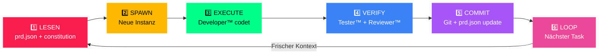

<](https://github.com/D-VKITZ/bmad-framework)
[](./dkz-developer/ralph-loop.md)
[](./LICENSE)
[](https://github.com/D-VKITZ)

---

*7 spezialisierte KI-Agenten · 6-Phasen Execution Pipeline · Frischer Kontext pro Task*

</div>

---

## 📋 Was ist BMAD™?

**BMAD** steht für **Blueprint → Mapping → Analyse → Design** — eine strukturierte Methodik zur KI-gestützten Softwareentwicklung. Jeder Schritt wird von spezialisierten Agenten ausgeführt, die zusammen ein vollständiges Entwickler-Ökosystem bilden.

```
B — Blueprint    → Anforderungen definieren (PM™)
M — Mapping      → Architektur planen (Architekt™)
A — Analyse      → Code prüfen (Reviewer™ + Tester™)
D — Design       → Implementieren + Dokumentieren (Developer™ + Dokumentar™)
```

**James™** überwacht den gesamten Prozess als Guardian.

---

## 🤖 Die 7 Agenten

| # | Agent | Team | Rolle | Ordner |
|:--|:------|:-----|:------|:-------|
| 1 | 🎯 **James™** | `james-guardian` | Guardian — überwacht alle, coded NICHT | [`james-guardian/`](./james-guardian/) |
| 2 | 📋 **DkZ PM™** | `dkz-pm` | Product Manager — PRD, User Stories | [`dkz-pm/`](./dkz-pm/) |
| 3 | 🏗️ **DkZ Architekt™** | `dkz-architekt` | Architektur — plan.md, Tech-Stack | [`dkz-architekt/`](./dkz-architekt/) |
| 4 | 👨‍💻 **DkZ Developer™** | `dkz-developer` | Coder — Ralph-Loop™ Executor | [`dkz-developer/`](./dkz-developer/) |
| 5 | 🔍 **DkZ Reviewer™** | `dkz-reviewer` | CodeRabbit — Qualitätsprüfung | [`dkz-reviewer/`](./dkz-reviewer/) |
| 6 | 🧪 **DkZ Tester™** | `dkz-tester` | Tests + Validierung | [`dkz-tester/`](./dkz-tester/) |
| 7 | 📚 **DkZ Dokumentar™** | `dkz-dokumentar` | README, Wiki, Learnings | [`dkz-dokumentar/`](./dkz-dokumentar/) |

---

## 🔄 Ralph-Loop™ — 6-Phasen Pipeline

Das Herzstück von BMAD™. Jeder Task durchläuft 6 Phasen mit **frischem Kontext** — kein Context Drift!



**Kernprinzip:** Jeder Task bekommt frischen Kontext — kein Context Drift!

| Phase | Agent | Aktion |
|:------|:------|:-------|
| 1. LESEN | James™ | prd.json + Constitution laden, relevante Artefakte injizieren |
| 2. SPAWN | James™ | Neue Agent-Instanz mit frischem Kontext starten |
| 3. EXECUTE | Developer™ | Code schreiben nach Plan |
| 4. VERIFY | Reviewer™ + Tester™ | Qualitätsprüfung + Tests |
| 5. COMMIT | Developer™ | Git commit + prd.json Status-Update |
| 6. LOOP | James™ | Nächsten Task aus Queue holen → zurück zu Phase 1 |

---

## 🚀 Quick Start

```bash
# 1. Repo klonen
git clone https://github.com/D-VKITZ/bmad-framework.git
cd bmad-framework

# 2. Agent-Definition lesen
cat james-guardian/README.md

# 3. Workflow starten
cat workflows/startup.md
```

---

## ⚠️ Eiserne Regeln (Top 10)

| # | Regel |
|:--|:------|
| 1 | `esc()` bei JEDEM User-Input vor innerHTML — XSS-Schutz |
| 2 | DkZ CSS Variables — kein hardcoded `#fa1e4e` |
| 3 | Shared Scripts einbinden (`dkz-debug.js`, `dkz-guide.js`, `dkz-navbar.js`) |
| 4 | `features.json` nach Modul-Änderung aktualisieren |
| 5 | Git Commit nach JEDER Änderung |
| 6 | R24 ALARM vor Archivierung — 777 muss bestätigen |
| 7 | `99_ARCHIVE/` nur ablegen, NIEMALS löschen |
| 8 | Desktop nur ablegen — NIEMALS bestehende Dateien ändern |
| 9 | Kein `console.log` in Produktion |
| 10 | Kein jQuery ohne Rücksprache |

---

## 🔁 Session-Übergabe Checkliste

Bei Session-Ende IMMER prüfen:

- [ ] CLAUDE.md aktuell?
- [ ] GEMINI.md aktuell?
- [ ] Artefakte dreifach verankert? (Iceberg + Hub + Copilot)
- [ ] features.json aktualisiert?
- [ ] Git committed?
- [ ] Walkthrough/Notes gespeichert?
- [ ] Neue §-Einträge für neue Features?

---

## 📁 Repo-Struktur

```
bmad-framework/
├── james-guardian/      # 🎯 Guardian Agent
├── dkz-pm/              # 📋 Product Manager
├── dkz-architekt/       # 🏗️ Architekt
├── dkz-developer/       # 👨‍💻 Developer
├── dkz-reviewer/        # 🔍 Reviewer
├── dkz-tester/          # 🧪 Tester
├── dkz-dokumentar/      # 📚 Dokumentar
└── workflows/           # 🔄 Workflows
```

---

## 🔗 Verknüpfte Systeme

| System | Repo | Beschreibung |
|:-------|:-----|:-------------|
| 🐝 Agent Swarm™ | [agent-swarm](https://github.com/D-VKITZ/agent-swarm) | Multi-Agent Orchestrierung |
| 🌐 Dashboard | [D-VKITZ.github.io](https://github.com/D-VKITZ/D-VKITZ.github.io) | 132+ Module live |
| 🏠 Org | [D-VKITZ](https://github.com/D-VKITZ) | GitHub Organisation |

---

<div align="center">

**DEVKiTZ™** — Vollständiges KI-Entwickler-Ökosystem

*Built with 🎯 by 777*

</div>
]]>
