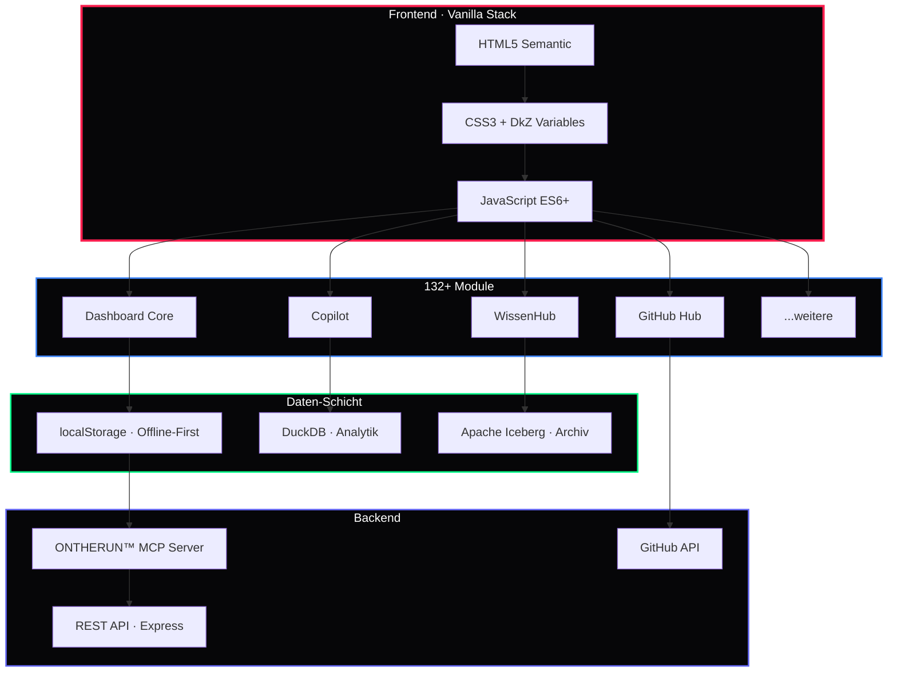

<div align="center">

# 🏗️ DkZ Architekt™

### *Der Systemarchitekt des DEVKiTZ™ Ökosystems*

**Tech-Stack Design · Architektur-Entscheidungen · Modul-Patterns · plan.md Output**

---


---

*Teil des [DEVKiTZ™ Ökosystems](https://github.com/777/devkitz-ecosystem) · BMAD™ Methodik Agent #3*

</div>

---

## 📖 Übersicht

**DkZ Architekt™** entwirft die technische Architektur des DEVKiTZ™ Dashboards und aller 132+ Module. Er trifft Tech-Stack-Entscheidungen, definiert Modul-Patterns und erstellt `plan.md`-Dateien, die dem Developer™ als Bauplan dienen. Jede architektonische Entscheidung folgt dem Prinzip: **Vanilla First, Offline First, Performance First**.

Der Architekt™ garantiert, dass keine Frameworks (React, Vue, Angular) in das System gelangen und dass alle Module über CSS Custom Properties, Shared Scripts und standardisierte APIs kommunizieren.

---

## 🏛️ System-Architektur



---

## 📊 Input / Output Matrix

| Richtung | Typ | Beschreibung |
|:---------|:----|:-------------|
| 📥 Input | `prd.json` | Product Requirements vom PM™ |
| 📥 Input | `spec.md` | Feature-Spezifikation mit Akzeptanzkriterien |
| 📥 Input | Tech-Constraints | DkZ-Regeln: kein Framework, Vanilla only |
| 📥 Input | Performance-Budgets | Lighthouse Scores, Bundle-Limits |
| 📤 Output | `plan.md` | Technischer Implementierungsplan |
| 📤 Output | Architektur-Diagramme | Mermaid-Diagramme für Modul-Interaktionen |
| 📤 Output | API-Definitionen | REST-Endpunkte, MCP-Tool-Interfaces |
| 📤 Output | Modul-Templates | Standardisierte Boilerplates für neue Module |

---

## 🤝 Interaktions-Matrix

| Agent | Interaktion | Beschreibung |
|:------|:------------|:-------------|
| 🎯 James™ | `Compliance` | Tech-Stack Freigabe, Regel-Konformität |
| 📋 DkZ PM™ | `Input` | PRD empfangen, technische Machbarkeit bewerten |
| 👨‍💻 DkZ Developer™ | `Übergabe` | plan.md bereitstellen, Architektur-Fragen klären |
| 🔍 DkZ Reviewer™ | `Pattern-Check` | Architektur-Patterns in Reviews validieren |
| 🧪 DkZ Tester™ | `Testbarkeit` | Module testbar designen, Test-Hooks definieren |
| 📚 DkZ Dokumentar™ | `Dokumentation` | Architektur-Diagramme für Wiki bereitstellen |

---

## 🔧 Tech-Stack Entscheidungen

| Kategorie | Technologie | Begründung |
|:----------|:------------|:-----------|
| **Frontend** | Vanilla HTML5/CSS3/JS | Maximale Kontrolle, kein Framework-Lock-in |
| **Styling** | CSS Custom Properties | Konsistentes Theming über alle Module |
| **Fonts** | Inter + JetBrains Mono | UI-Lesbarkeit + Code-Darstellung |
| **Daten lokal** | localStorage | Offline-First, sofortige Verfügbarkeit |
| **Daten analytisch** | DuckDB | SQL-Queries direkt im Browser/Server |
| **Daten archiv** | Apache Iceberg | Langzeit-Persistenz, Schema-Evolution |
| **Backend** | Node.js 18+ / Express | Leichtgewichtig, MCP-kompatibel |
| **API** | REST + MCP | Standard-Interop + KI-Agent-Integration |
| **CI/CD** | GitHub Actions | Automatisierte Tests, Deployments |
| **Hosting** | GitHub Pages | Kostenlos, schnell, versioniert |

---

## 📐 Modul-Design Pattern

Jedes Modul folgt einer standardisierten Struktur:

```
modules/
└── modul-name/
    ├── index.html          # Standalone-Seite
    ├── modul-name.css       # Modul-spezifische Styles
    ├── modul-name.js        # Modul-Logik
    ├── features.json        # Feature-Flags + Status
    └── README.md            # Modul-Dokumentation
```

```javascript
// Standard Modul-Initialisierung
const ModulName = {
  config: {
    version: '1.0.0',
    module: 'modul-name',
    dependencies: ['dkz-navbar', 'dkz-debug']
  },

  init() {
    this.loadSharedScripts();
    this.setupEventListeners();
    this.render();
  },

  loadSharedScripts() {
    // dkz-navbar.js, dkz-debug.js, dkz-guide.js
    const scripts = ['navbar', 'debug', 'guide'];
    scripts.forEach(s => {
      const el = document.createElement('script');
      el.src = `../../shared/dkz-${s}.js`;
      document.head.appendChild(el);
    });
  },

  render() {
    // IMMER esc() bei User-Input!
    const container = document.getElementById('app');
    container.innerHTML = `<div class="dkz-module">${esc(this.config.module)}</div>`;
  }
};

document.addEventListener('DOMContentLoaded', () => ModulName.init());
```

---

## 🧠 Best Practices

- **Kein Framework** — NIEMALS React, Vue oder Angular vorschlagen
- **CSS Variables** — Hardcodierte Farben sind verboten (`var(--accent)` statt `#fa1e4e`)
- **Offline-First** — Jedes Feature muss ohne Netzwerk grundlegend funktionieren
- **Mobile-First** — Responsive Design beginnt bei 320px
- **Semantic HTML** — Korrekte Heading-Hierarchie, ARIA-Labels, Landmarks
- **Performance** — Lighthouse Score > 90 für alle Module

---

<div align="center">

---

**🏗️ DkZ Architekt™** · Teil der [BMAD™ Methodik](https://github.com/777/devkitz-ecosystem)

Gebaut mit 🖤 von **DEVKiTZ™** · `#060608` · Keine Frameworks. Kein Kompromiss.


</div>
