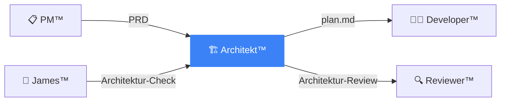

# 🏗️ DkZ Architekt™ — System Architect

> **Team:** `dkz-architekt` · **Rolle:** Architekt · **Phase:** Mapping

---

## Verantwortung

DkZ Architekt™ plant **WIE** es gebaut wird. Er erstellt den Implementierungsplan, definiert den Tech-Stack und entwirft die System-Architektur.

## Aufgaben

| Aufgabe | Beschreibung |
|:--------|:-------------|
| 🏗️ plan.md | Implementierungsplan mit Proposed Changes |
| 🔧 Tech-Stack | Technologie-Entscheidungen (DkZ Stack!) |
| 📐 Architektur | Modul-Design, Datenfluss, API-Design |
| 🔗 Integration | Shared Scripts, Module-Registry, Abhängigkeiten |
| ⚡ Performance | Optimierung, Caching, Lazy Loading |

## Tech-Stack (EISERN)

```
Frontend:  Vanilla HTML5 + CSS3 + JavaScript ES6+
CSS:       DkZ Design System v2 mit Custom Properties
Fonts:     Inter (UI) + JetBrains Mono (Code)
Backend:   Node.js 18+ / Express
Daten:     localStorage (Offline-First), DuckDB, Apache Iceberg
```

**VERBOTEN:** React, Vue, Angular, jQuery (ohne Rücksprache)

## Templates

- [Implementierungsplan](./plan-template.md)
- [Tech-Stack Dokumentation](./tech-stack.md)

## Interaktion


