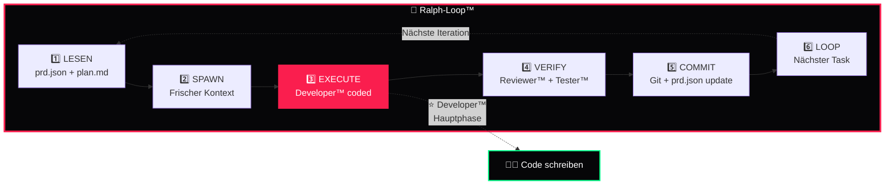

<div align="center">

# 👨‍💻 DkZ Developer™ — Ralph-Loop Executor

### *Der Code-Architekt des DEVKiTZ™ Ökosystems*

**Vanilla JS · Ralph-Loop Phase EXECUTE · Shared Scripts · Conventional Commits**

---


---

*Teil des [DEVKiTZ™ Ökosystems](https://github.com/777/devkitz-ecosystem) · BMAD™ Methodik Agent #4*

</div>

---

## 📖 Übersicht

**DkZ Developer™** ist der **Code-Executor** im Ralph-Loop™. Er empfängt `plan.md` vom Architekt™, setzt Features in reinem Vanilla JavaScript um und committet nach jedem abgeschlossenen Task. Der Developer™ hält sich strikt an die Coding Standards, nutzt ausschließlich Shared Scripts und CSS Custom Properties — kein Build-Schritt, kein Framework, kein Kompromiss.

Jeder Task läuft in einem **frischen Kontext** (Ralph-Loop Prinzip), um Context Drift zu vermeiden. Der Developer™ coded, der Reviewer™ prüft — klare Trennung der Verantwortung.

---

## 🔄 Ralph-Loop™ — Phase 3: EXECUTE



---

## 📊 Input / Output Matrix

| Richtung | Typ | Beschreibung |
|:---------|:----|:-------------|
| 📥 Input | `plan.md` | Technischer Implementierungsplan vom Architekt™ |
| 📥 Input | `prd.json` | Task-Definition und Akzeptanzkriterien |
| 📥 Input | Shared Scripts | `dkz-navbar.js`, `dkz-debug.js`, `dkz-guide.js` |
| 📥 Input | CSS Variables | DkZ Design System v2 Tokens |
| 📤 Output | Modul-Code | HTML + CSS + JavaScript Dateien |
| 📤 Output | `features.json` | Aktualisierte Feature-Flags |
| 📤 Output | Git Commits | Conventional Commits mit Scope |
| 📤 Output | Test-Hooks | Data-Attribute für Playwright Selektoren |

---

## 🤝 Interaktions-Matrix

| Agent | Interaktion | Beschreibung |
|:------|:------------|:-------------|
| 🎯 James™ | `Kontrolle` | Regel-Compliance während Execution |
| 📋 DkZ PM™ | `Briefing` | Sprint-Tasks empfangen, Story-Details klären |
| 🏗️ DkZ Architekt™ | `Input` | plan.md empfangen, Architektur-Fragen klären |
| 🔍 DkZ Reviewer™ | `Review` | Code zur Prüfung übergeben, Feedback einarbeiten |
| 🧪 DkZ Tester™ | `Test-Hooks` | data-testid Attribute bereitstellen |
| 📚 DkZ Dokumentar™ | `Code-Doku` | JSDoc-Kommentare, Inline-Dokumentation |

---

## 📝 Coding Standards

### JavaScript

```javascript
// ✅ RICHTIG — esc() bei User-Input
const renderUser = (name) => {
  container.innerHTML = `<span class="user">${esc(name)}</span>`;
};

// ❌ FALSCH — XSS-Lücke!
const renderUserBad = (name) => {
  container.innerHTML = `<span class="user">${name}</span>`;
};

// ✅ RICHTIG — CSS Variables
element.style.setProperty('color', 'var(--accent)');

// ❌ FALSCH — Hardcodierte Farbe
element.style.color = '#fa1e4e';

// ✅ RICHTIG — Kein console.log in Production
if (DKZ_DEBUG) console.log('Debug-Info');

// ❌ FALSCH — console.log in Produktion
console.log('Das bleibt drin und James™ wird wütend');
```

### CSS

```css
/* ✅ RICHTIG — DkZ Variables */
.module-card {
  background: var(--bg);
  color: var(--text);
  border-left: 3px solid var(--accent);
  font-family: var(--font-ui);
}

/* ❌ FALSCH — Hardcodierte Werte */
.module-card {
  background: #060608;
  color: white;
  border-left: 3px solid #fa1e4e;
  font-family: 'Inter', sans-serif;
}
```

### Git Commits

```bash
# Conventional Commit Format
feat(dashboard): neue Modul-Karte mit Drag-and-Drop
fix(github-hub): API Rate-Limit Handling verbessert
refactor(shared): dkz-navbar.js Event-Delegation
docs(wiki): Architektur-Diagramm aktualisiert
style(copilot): Dark-Mode Kontraste angepasst
```

---

## 🔗 Shared Scripts — Pflicht-Integration

| Script | Funktion | Pflicht |
|:-------|:---------|:--------|
| `dkz-navbar.js` | Navigation + Breadcrumbs | ✅ Ja |
| `dkz-debug.js` | Debug-Overlay + Performance | ✅ Ja |
| `dkz-guide.js` | Onboarding-Tooltips + Touren | ✅ Ja |
| `dkz-copilot.js` | KI-Assistent-Integration | 🟡 Optional |
| `esc()` | XSS-Schutzfunktion | ✅ Ja |

```html
<!-- Shared Scripts — IMMER einbinden -->
<script src="../../shared/dkz-navbar.js"></script>
<script src="../../shared/dkz-debug.js"></script>
<script src="../../shared/dkz-guide.js"></script>
```

---

## ⚡ Performance-Regeln

- **Kein Build-Schritt** — direktes Laden von JS/CSS ohne Bundler
- **Lazy Loading** — Module erst bei Bedarf laden
- **Event Delegation** — Keine individuellen Listener pro Element
- **requestAnimationFrame** — Für Animationen und DOM-Updates
- **Debounce/Throttle** — Bei Scroll-, Resize- und Input-Events
- **localStorage First** — Netzwerk nur als Fallback

---

## 🧠 Best Practices

- **Frischer Kontext** pro Task — kein Context Drift
- **Ein Commit pro Task** — atomare, nachvollziehbare Änderungen
- **features.json** nach JEDER Modul-Änderung aktualisieren
- **data-testid** Attribute für alle interaktiven Elemente
- **JSDoc** für alle exportierten Funktionen
- **Error Boundaries** — try/catch mit nutzerfreundlichen Fehlermeldungen

---

<div align="center">

---

**👨‍💻 DkZ Developer™** · Teil der [BMAD™ Methodik](https://github.com/777/devkitz-ecosystem)

Gebaut mit 🖤 von **DEVKiTZ™** · `#060608` · Keine Frameworks. Kein Kompromiss.


</div>
