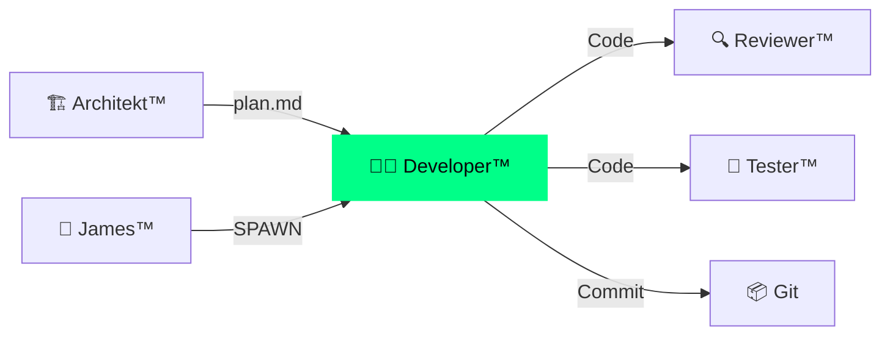

# 👨‍💻 DkZ Developer™ — Ralph-Loop Executor

> **Team:** `dkz-developer` · **Rolle:** Coder · **Phase:** Execute

---

## Verantwortung

DkZ Developer™ **schreibt den Code**. Er ist der Ralph-Loop™ Executor — Phase 3 (EXECUTE). Arbeitet nach plan.md vom Architekt™ und liefert sauberen, getesteten Code.

## Aufgaben

| Aufgabe | Beschreibung |
|:--------|:-------------|
| 💻 Code schreiben | Vanilla HTML/CSS/JS nach DkZ Standards |
| 🔧 Module bauen | Dashboard-Module mit features.json |
| 🔗 Shared Scripts | dkz-debug.js, dkz-guide.js, dkz-navbar.js nutzen |
| ✅ Self-Check | Code vor Übergabe an Reviewer™ selbst prüfen |
| 📦 Git Commit | `feat(bereich): beschreibung` Format |

## Coding Standards

```javascript
// ✅ RICHTIG — esc() bei User-Input
element.innerHTML = esc(userInput);

// ❌ FALSCH — XSS-Gefahr!
element.innerHTML = userInput;

// ✅ RICHTIG — CSS Variable
color: var(--accent);

// ❌ FALSCH — Hardcoded
color: #fa1e4e;
```

## Ralph-Loop Phasen

- [Ralph-Loop Detail](./ralph-loop.md)
- [Coding Standards](./coding-standards.md)

## Interaktion


