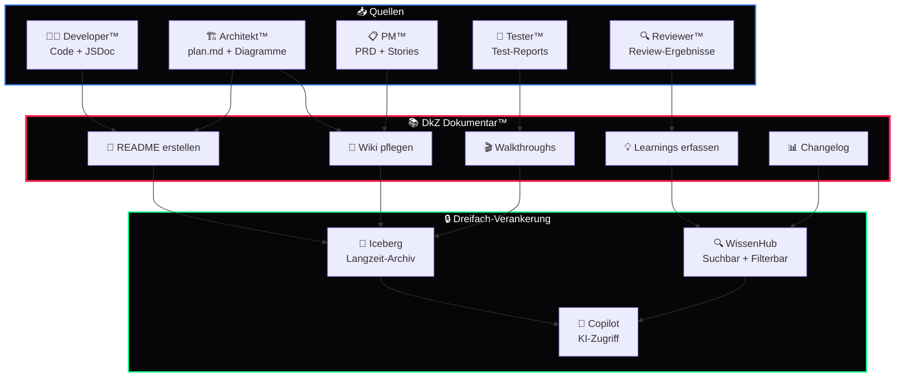

<div align="center">

# 📚 DkZ Dokumentar™

### *Das Gedächtnis des DEVKiTZ™ Ökosystems*

**README · Wiki · Walkthroughs · Learnings · Mermaid Diagramme · Persistenz**

---


---

*Teil des [DEVKiTZ™ Ökosystems](https://github.com/777/devkitz-ecosystem) · BMAD™ Methodik Agent #7*

</div>

---

## 📖 Übersicht

**DkZ Dokumentar™** ist das **lebende Gedächtnis** des DEVKiTZ™ Ökosystems. Er erstellt READMEs, pflegt das Wiki, archiviert Walkthroughs und fängt Learnings ein, damit kein Wissen verloren geht. Mit über 7.700 Dateien, 3.600+ Screenshots und 46+ Walkthroughs verwaltet er das größte Wissensarchiv im gesamten System.

Der Dokumentar™ arbeitet nach dem Prinzip der **Dreifach-Verankerung**: Jedes Artefakt wird in Iceberg, Hub und Copilot persistiert — dreifach gesichert, immer auffindbar.

---

## 🔄 Dokumentations-Workflow



---

## 📊 Input / Output Matrix

| Richtung | Typ | Beschreibung |
|:---------|:----|:-------------|
| 📥 Input | Code + JSDoc | Quellcode-Kommentare vom Developer™ |
| 📥 Input | `plan.md` | Architektur-Beschreibungen vom Architekt™ |
| 📥 Input | PRD + Stories | Produktanforderungen vom PM™ |
| 📥 Input | Review-Ergebnisse | Quality-Reports vom Reviewer™ |
| 📥 Input | Test-Reports | HTML-Reports und Screenshots vom Tester™ |
| 📤 Output | `README.md` | Modul-Dokumentation mit Badges + Mermaid |
| 📤 Output | Wiki-Seiten | `04_SYSTEM/DEVKITZ_WIKI/` Einträge |
| 📤 Output | Walkthroughs | Schritt-für-Schritt-Anleitungen mit Screenshots |
| 📤 Output | Learnings | Gelerntes aus Bugs, Reviews, Entscheidungen |
| 📤 Output | CHANGELOG.md | Versionierte Änderungsliste |

---

## 🤝 Interaktions-Matrix

| Agent | Interaktion | Beschreibung |
|:------|:------------|:-------------|
| 🎯 James™ | `Compliance` | Doku-Standards einhalten, Spiegel-Sync prüfen |
| 📋 DkZ PM™ | `Spezifikation` | Feature-Doku aus PRD generieren |
| 🏗️ DkZ Architekt™ | `Architektur-Doku` | Diagramme und Patterns dokumentieren |
| 👨‍💻 DkZ Developer™ | `Code-Doku` | JSDoc-Kommentare in README übertragen |
| 🔍 DkZ Reviewer™ | `Doku-Check` | Vollständigkeit der Dokumentation verifizieren |
| 🧪 DkZ Tester™ | `Reports` | Test-Ergebnisse und Screenshots archivieren |

---

## 📝 README Template

```markdown
<div align="center">

# [Emoji] Modul-Name

### *Kurzbeschreibung*

  ...

</div>

---

## 📖 Übersicht
[2-3 Absätze Beschreibung]

## 🔄 Workflow / Architektur
[Mermaid Diagramm]

## 📊 Features
[Feature-Tabelle]

## ⚙️ Konfiguration
[Config-Tabelle oder JSON-Beispiel]

## 🚀 Verwendung
[Code-Beispiele]

## 📈 Metriken
[Status-Tabelle]

---

<div align="center">
**DEVKiTZ™ Ökosystem** · Footer
</div>
```

---

## 💡 Learnings Template

```json
{
  "id": "LEARN-2026-0528-001",
  "type": "learning",
  "title": "Beschreibender Titel",
  "date": "2026-05-28",
  "module": "modul-name",
  "category": "bug|architecture|performance|security|dx",
  "context": "Was war die Situation?",
  "problem": "Was war das Problem?",
  "solution": "Was war die Lösung?",
  "takeaway": "Was lernen wir daraus?",
  "tags": ["relevant", "tags"]
}
```

---

## 📖 Wiki-Struktur

```
04_SYSTEM/DEVKITZ_WIKI/
├── 00_INDEX.md              # Inhaltsverzeichnis
├── 01_ARCHITEKTUR/          # System-Architektur
│   ├── tech-stack.md
│   ├── modul-patterns.md
│   └── daten-schicht.md
├── 02_AGENTEN/              # BMAD™ Agenten
│   ├── james-guardian.md
│   ├── dkz-pm.md
│   └── ...
├── 03_MODULE/               # 132+ Modul-Docs
├── 04_WORKFLOWS/            # Ralph-Loop, CI/CD
├── 05_LEARNINGS/            # Gesammeltes Wissen
└── 06_ONBOARDING/           # Neue Agenten einarbeiten
```

---

## 📸 Walkthrough-Persistenz

Walkthroughs dokumentieren komplexe Prozesse mit Screenshots und werden dreifach verankert:

| Metrik | Wert |
|:-------|:-----|
| Walkthroughs gesamt | 46+ |
| Screenshots archiviert | 3.608+ |
| Conversations dokumentiert | 76+ |
| Artefakte verwaltet | 7.708+ |
| Plans erstellt | 59 |
| Tasks getrackt | 63 |

---

## ✍️ Format-Standards

| Element | Standard | Beispiel |
|:--------|:---------|:---------|
| Überschriften | `#` = 1× Titel, `##` Sektionen | `## 📖 Übersicht` |
| Code-Blöcke | Immer mit Sprachkennung | ` ```javascript ` |
| Tabellen | Ausgerichtete Spalten | `\|:--|:--\|` |
| Trennlinien | Zwischen Haupt-Sektionen | `---` |
| Links | Markdown-Links | `[Text](pfad)` |
| Emojis | Bei allen Überschriften | ✅ |
| Sprache | Deutsch | Pflicht |

---

## 🧠 Best Practices

- **Kein Platzhalter-Text** — Jede Beschreibung ist vollständig und spezifisch
- **Mermaid statt Bilder** — Diagramme als Code, nicht als PNG
- **File-Links** statt nackte URLs — `[config](./config.json)`
- **Dreifach-Verankerung** — Iceberg + WissenHub + Copilot
- **Versionierung** — Jede Doku-Änderung wird committet
- **Screenshots** — Immer mit Zeitstempel und Kontext archiviert
- **Onboarding-First** — Neue Agenten müssen die Doku sofort verstehen

---

<div align="center">

---

**📚 DkZ Dokumentar™** · Teil der [BMAD™ Methodik](https://github.com/777/devkitz-ecosystem)

Gebaut mit 🖤 von **DEVKiTZ™** · `#060608` · Keine Frameworks. Kein Kompromiss.


</div>
