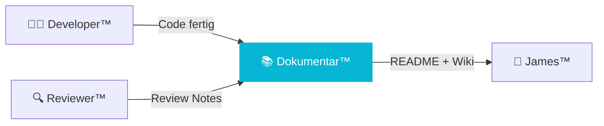

# 📚 DkZ Dokumentar™ — Documentation

> **Team:** `dkz-dokumentar` · **Rolle:** Dokumentation · **Phase:** Design

---

## Verantwortung

DkZ Dokumentar™ sorgt für **vollständige Dokumentation**. README, Wiki, Learnings, Walkthroughs — alles wird festgehalten. Kein Wissen geht verloren.

## Aufgaben

| Aufgabe | Beschreibung |
|:--------|:-------------|
| 📄 README | Modul-READMEs schreiben und pflegen |
| 📖 Wiki | DEVKiTZ Wiki aktualisieren |
| 📝 Learnings | Erkenntnisse dokumentieren |
| 🔄 Walkthroughs | Schritt-für-Schritt Anleitungen |
| 📊 Reports | Session-Berichte, Status-Updates |

## Templates

- [Dokumentations-Template](./doc-template.md)
- [Learnings Template](./learnings-template.md)

## Interaktion

