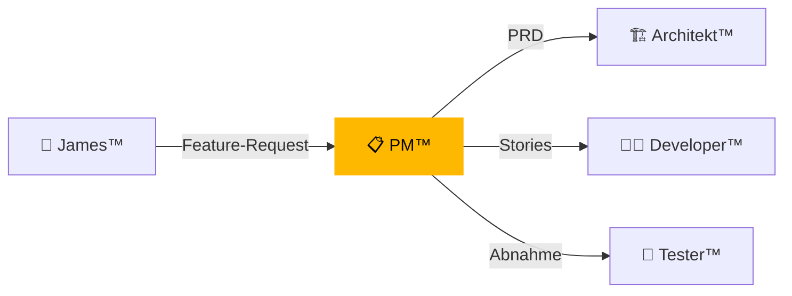

# 📋 DkZ PM™ — Product Manager

> **Team:** `dkz-pm` · **Rolle:** Product Manager · **Phase:** Blueprint

---

## Verantwortung

DkZ PM™ definiert **WAS** gebaut wird. Er erstellt PRDs (Product Requirements Documents), schreibt User Stories und priorisiert den Backlog.

## Aufgaben

| Aufgabe | Beschreibung |
|:--------|:-------------|
| 📝 PRD erstellen | Product Requirements Document mit Akzeptanzkriterien |
| 👤 User Stories | Als [Rolle] möchte ich [Funktion] damit [Nutzen] |
| 📊 Backlog | Task-Priorisierung und Sprint-Planung |
| 🎯 Scope | Feature-Scope definieren und abgrenzen |
| ✅ Abnahme | Fertige Features gegen PRD prüfen |

## Input / Output

| Richtung | Typ | Beschreibung |
|:---------|:----|:-------------|
| 📥 Input | Feature-Request | Anforderung von 777 |
| 📥 Input | Feedback | User-Feedback und Bugs |
| 📤 Output | prd.json | Strukturiertes PRD |
| 📤 Output | spec.md | Feature-Spezifikation |
| 📤 Output | User Stories | Priorisierte Story-Liste |

## Templates

- [PRD Template](./prd-template.md)
- [User Story Template](./user-story-template.md)

## Interaktion

