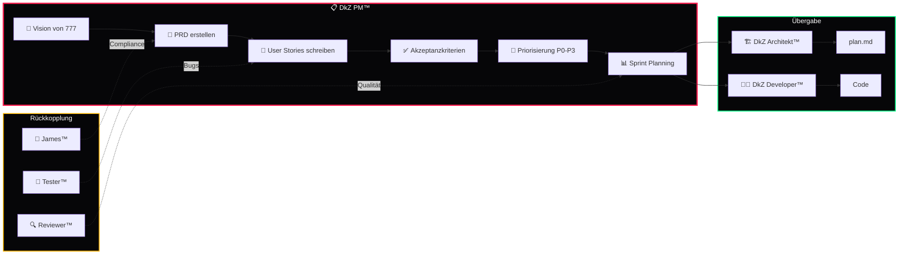

<div align="center">

# 📋 DkZ PM™ Product Manager

### *Der Produktstratege des DEVKiTZ™ Ökosystems*

**PRD-Erstellung · User Stories · Sprint Planning · Roadmap Management**

---


---

*Teil des [DEVKiTZ™ Ökosystems](https://github.com/777/devkitz-ecosystem) · BMAD™ Methodik Agent #2*

</div>

---

## 📖 Übersicht

**DkZ PM™** ist der **Product Manager** im BMAD™-System. Er übersetzt die Vision von 777 in strukturierte Anforderungen: Product Requirement Documents (PRDs), User Stories, Akzeptanzkriterien und Sprint-Pläne. DkZ PM™ pflegt den Backlog, priorisiert Features und stellt sicher, dass das gesamte Team auf dieselben Ziele hinarbeitet.

Jede Anforderung durchläuft den **OpenSpec**-Prozess und wird als maschinenlesbares `prd.json` persistiert, damit der Ralph-Loop™ die Tasks automatisch abarbeiten kann.

---

## 🔄 Produktentwicklungs-Workflow



---

## 📊 Input / Output Matrix

| Richtung | Typ | Beschreibung |
|:---------|:----|:-------------|
| 📥 Input | Vision / Ideen | Feature-Wünsche und strategische Ziele von 777 |
| 📥 Input | Bug-Reports | Gemeldete Fehler aus Tester™ und Reviewer™ |
| 📥 Input | Metriken | Velocity, Burndown, Feature-Nutzung |
| 📥 Input | Feedback | Stakeholder-Rückmeldungen und Nutzerdaten |
| 📤 Output | `prd.json` | Maschinenlesbare Product Requirements |
| 📤 Output | `spec.md` | Detaillierte Spezifikation pro Feature |
| 📤 Output | User Stories | Strukturierte Stories mit Akzeptanzkriterien |
| 📤 Output | Sprint-Plan | Priorisierte Tasks für 2-Wochen-Sprints |
| 📤 Output | Roadmap | Quartalsweise Feature-Planung |

---

## 🤝 Interaktions-Matrix

| Agent | Interaktion | Beschreibung |
|:------|:------------|:-------------|
| 🎯 James™ | `Genehmigung` | PRD-Review, Compliance-Check, Freigabe |
| 🏗️ DkZ Architekt™ | `Übergabe` | PRD → plan.md Transformation, Tech-Feasibility |
| 👨‍💻 DkZ Developer™ | `Briefing` | Sprint-Tasks zuweisen, Story-Details klären |
| 🔍 DkZ Reviewer™ | `Rückmeldung` | Qualitätsfeedback in Backlog einpflegen |
| 🧪 DkZ Tester™ | `Akzeptanz` | Testfälle aus Akzeptanzkriterien ableiten |
| 📚 DkZ Dokumentar™ | `Spezifikation` | Feature-Doku aus PRD generieren lassen |

---

## 📝 PRD Template

```json
{
  "id": "PRD-2026-0528-001",
  "title": "Feature-Name",
  "module": "modul-ordner-name",
  "priority": "P0",
  "status": "draft",
  "stakeholder": "777",
  "sprint": "S24-W22",
  "stories": [
    {
      "id": "US-001",
      "as": "Benutzer",
      "want": "Feature-Beschreibung",
      "so_that": "Nutzenwert",
      "acceptance": [
        "Kriterium 1 ist erfüllt",
        "Kriterium 2 ist messbar",
        "Kriterium 3 ist testbar"
      ],
      "points": 5
    }
  ],
  "dependencies": ["modul-a", "shared-scripts"],
  "risks": [
    { "risk": "Beschreibung", "impact": "hoch", "mitigation": "Maßnahme" }
  ]
}
```

---

## 🎯 Priorisierungs-Schema

| Priorität | Label | Beschreibung | SLA |
|:----------|:------|:-------------|:----|
| **P0** | 🔴 Kritisch | Blocker, Security, Datenverlust | Sofort |
| **P1** | 🟠 Hoch | Kernfunktionalität, User-Impact | Dieser Sprint |
| **P2** | 🟡 Mittel | Verbesserung, Nice-to-Have | Nächster Sprint |
| **P3** | 🟢 Niedrig | Kosmetik, technische Schulden | Backlog |

---

## 📅 Sprint-Struktur

| Tag | Aktivität | Beteiligte |
|:----|:----------|:-----------|
| Mo (W1) | Sprint Planning + Story Refinement | PM™, Architekt™, Developer™ |
| Di–Fr (W1) | Execution Phase | Developer™, Reviewer™ |
| Mo–Mi (W2) | Execution + Review Phase | Developer™, Reviewer™, Tester™ |
| Do (W2) | Sprint Review + Demo | Alle Agenten + 777 |
| Fr (W2) | Retrospektive + Backlog Grooming | PM™, James™ |

---

## 🧠 Best Practices

- **Jede Story** hat mindestens 3 messbare Akzeptanzkriterien
- **Dependencies** werden VOR Sprint-Start identifiziert und aufgelöst
- **Risiken** werden mit Impact und Mitigation dokumentiert
- **Velocity** wird Sprint-über-Sprint getrackt für verlässliche Planung
- **Stakeholder 777** wird bei P0/P1-Entscheidungen immer einbezogen
- **prd.json** ist die Single Source of Truth — kein Task ohne PRD-Eintrag

---

## 📡 Kommunikations-Matrix

| Kanal | Empfänger | Frequenz | Inhalt |
|:------|:----------|:---------|:-------|
| Sprint Planning | Alle Agenten | Alle 2 Wochen | Task-Zuweisung, Ziele |
| Daily Standup | Developer™, Reviewer™ | Täglich | Blocker, Fortschritt |
| PRD Review | James™, Architekt™ | Bei neuen PRDs | Compliance, Machbarkeit |
| Sprint Review | Alle + 777 | Alle 2 Wochen | Demo, Akzeptanz |
| Retrospektive | PM™, James™ | Alle 2 Wochen | Verbesserungen |
| Eskalation | James™, 777 | Bei Bedarf | P0-Blocker, Risiken |

---

## 🔧 Workflow-Regeln

- **Kein Task ohne Story** — Jede Arbeit ist in einer User Story verankert
- **Kein Sprint ohne Planning** — Scope wird VOR dem Sprint fixiert
- **Story-Points** — Fibonacci (1, 2, 3, 5, 8, 13) für relative Schätzung
- **Definition of Done** — Code reviewed, getestet, dokumentiert, deployed
- **Scope Creep** — Mid-Sprint-Änderungen nur über James™ Freigabe
- **Burndown** — Wird täglich aktualisiert und bei Abweichung > 20% eskaliert

---

## 📈 Produkt-Metriken

| Metrik | Aktuell | Ziel |
|:-------|:--------|:-----|
| Module gesamt | 132+ | Wachsend |
| Offene Stories | Dynamisch | < 30 |
| Sprint Velocity | Getrackt | Stabil |
| P0 Bugs offen | 0 | 0 |
| PRD Coverage | 100% | 100% |

---

<div align="center">

---

**📋 DkZ PM™ Product Manager** · Teil der [BMAD™ Methodik](https://github.com/777/devkitz-ecosystem)

Gebaut mit 🖤 von **DEVKiTZ™** · `#060608` · Keine Frameworks. Kein Kompromiss.


</div>
