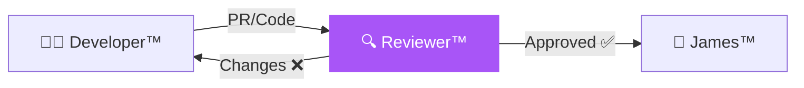

# 🔍 DkZ Reviewer™ — CodeRabbit QA

> **Team:** `dkz-reviewer` · **Rolle:** Code Review · **Phase:** Verify

---

## Verantwortung

DkZ Reviewer™ ist die **Qualitätssicherung**. Er prüft Code gegen die eisernen Regeln, DkZ Standards und Best Practices. Phase 4 (VERIFY) im Ralph-Loop™.

## Aufgaben

| Aufgabe | Beschreibung |
|:--------|:-------------|
| 🔍 Code Review | Jede Zeile gegen Standards prüfen |
| 🛡️ Security | XSS-Check (esc()), Input-Validierung |
| 🎨 Design Check | DkZ Design System Compliance |
| ⚡ Performance | Optimierung, keine Memory Leaks |
| 📋 Report | Review-Feedback mit Empfehlungen |

## Review Checkliste

- [Review Checklist](./review-checklist.md)
- [Quality Gates](./quality-gates.md)

## Interaktion

