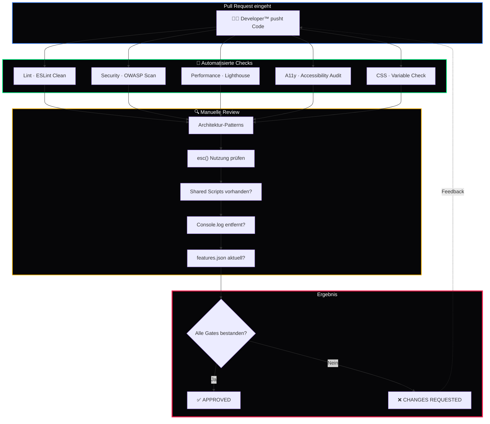

<div align="center">

# 🔍 DkZ Reviewer™ — CodeRabbit QA

### *Der Qualitätswächter des DEVKiTZ™ Ökosystems*

**Code Reviews · Quality Gates · Security Audits · Performance Checks**

---


_Enforced-fa1e4e?style=for-the-badge&logo=shield&logoColor=white)


---

*Teil des [DEVKiTZ™ Ökosystems](https://github.com/777/devkitz-ecosystem) · BMAD™ Methodik Agent #5*

</div>

---

## 📖 Übersicht

**DkZ Reviewer™** ist der **Qualitätswächter** im BMAD™-System und arbeitet in Ralph-Loop Phase 4 (VERIFY). Ausgestattet mit CodeRabbit-Integration prüft er jeden Code-Beitrag gegen die Quality Gates des DEVKiTZ™ Ökosystems. Kein Code erreicht den `main`-Branch ohne seine Freigabe.

Der Reviewer™ kombiniert automatisierte Checks (Lint, Security, Performance) mit manueller Architektur-Bewertung und stellt sicher, dass die eisernen Regeln eingehalten werden — von `esc()` über CSS Variables bis hin zum Framework-Verbot.

---

## 🔄 Review-Workflow



---

## 📊 Input / Output Matrix

| Richtung | Typ | Beschreibung |
|:---------|:----|:-------------|
| 📥 Input | Pull Request | Code-Änderungen vom Developer™ |
| 📥 Input | `plan.md` | Architektur-Referenz für Pattern-Checks |
| 📥 Input | Eiserne Regeln | 10 Pflicht-Regeln als Checkliste |
| 📥 Input | Lighthouse Reports | Automatisierte Performance-Metriken |
| 📤 Output | Review-Kommentare | Inline-Feedback mit Korrekturvorschlägen |
| 📤 Output | Approval / Rejection | Freigabe oder Änderungsanforderung |
| 📤 Output | Quality-Report | Zusammenfassung aller Checks |
| 📤 Output | Regel-Verstoß-Meldung | Eskalation an James™ bei kritischen Verstößen |

---

## 🤝 Interaktions-Matrix

| Agent | Interaktion | Beschreibung |
|:------|:------------|:-------------|
| 🎯 James™ | `Eskalation` | Kritische Verstöße melden, Freigabe-Blockade |
| 📋 DkZ PM™ | `Feedback` | Qualitäts-Metriken für Sprint-Retrospektiven |
| 🏗️ DkZ Architekt™ | `Pattern-Check` | Architektur-Konformität validieren |
| 👨‍💻 DkZ Developer™ | `Review` | Code prüfen, Feedback geben, Approval |
| 🧪 DkZ Tester™ | `Koordination` | Test-Coverage vor Approval prüfen |
| 📚 DkZ Dokumentar™ | `Doku-Check` | README + JSDoc Vollständigkeit prüfen |

---

## ✅ Review-Checkliste

### 🔴 Kritisch (Blocker)

| # | Check | Regel |
|:--|:------|:------|
| 1 | `esc()` bei jedem User-Input vor `innerHTML` | XSS-Schutz |
| 2 | Keine Frameworks (React, Vue, Angular) | Vanilla Only |
| 3 | Kein `console.log` in Produktion | Console Clean |
| 4 | `99_ARCHIVE/` wird nicht gelöscht | Archiv Protected |

### 🟡 Hoch (Muss vor Merge)

| # | Check | Regel |
|:--|:------|:------|
| 5 | CSS Custom Properties statt Hardcoded | DkZ Variables |
| 6 | Shared Scripts eingebunden | dkz-navbar, dkz-debug, dkz-guide |
| 7 | `features.json` aktualisiert | Feature-Tracking |
| 8 | Git Commit Message = Conventional | feat/fix/refactor(scope) |

### 🟢 Standard (Best Practice)

| # | Check | Regel |
|:--|:------|:------|
| 9 | Semantic HTML | Heading-Hierarchie, ARIA |
| 10 | Performance Budget | Lighthouse > 90 |
| 11 | Mobile-First Responsive | Ab 320px |
| 12 | Test-Hooks vorhanden | data-testid Attribute |

---

## 🛡️ Security-Checks (OWASP)

```javascript
// Review-Pattern: XSS-Erkennung
const xssPatterns = [
  /\.innerHTML\s*=\s*(?!.*esc\()/, // innerHTML ohne esc()
  /\.outerHTML\s*=/,                // outerHTML Zuweisung
  /document\.write\(/,             // document.write
  /eval\(/,                        // eval() Nutzung
  /setTimeout\(\s*["']/,           // setTimeout mit String
  /setInterval\(\s*["']/           // setInterval mit String
];

// Automatisierter Check
const auditFile = (content) => {
  const violations = [];
  xssPatterns.forEach((pattern, i) => {
    if (pattern.test(content)) {
      violations.push({
        rule: `XSS-${i + 1}`,
        severity: 'CRITICAL',
        action: 'BLOCK_MERGE'
      });
    }
  });
  return violations;
};
```

---

## 📈 Quality Gates

| Gate | Schwelle | Tool |
|:-----|:---------|:-----|
| Test Coverage | ≥ 80% | Playwright |
| Lighthouse Performance | ≥ 90 | Lighthouse CI |
| Lighthouse Accessibility | ≥ 95 | Lighthouse CI |
| Security Vulnerabilities | 0 kritisch | OWASP Scanner |
| CSS Variable Compliance | 100% | Custom Linter |
| Console.log Statements | 0 | ESLint Rule |
| Framework Imports | 0 | Import Scanner |

---

## 🧠 Best Practices

- **Jede Zeile** mit User-Input-Kontakt wird auf `esc()` geprüft
- **Review-Kommentare** sind konstruktiv und enthalten Code-Vorschläge
- **Pattern-Verstöße** werden mit Referenz auf Architektur-Docs dokumentiert
- **Performance-Regression** blockiert den Merge automatisch
- **Pair-Review** bei Security-relevantem Code mit James™

---

<div align="center">

---

**🔍 DkZ Reviewer™ CodeRabbit QA** · Teil der [BMAD™ Methodik](https://github.com/777/devkitz-ecosystem)

Gebaut mit 🖤 von **DEVKiTZ™** · `#060608` · Keine Frameworks. Kein Kompromiss.


</div>
