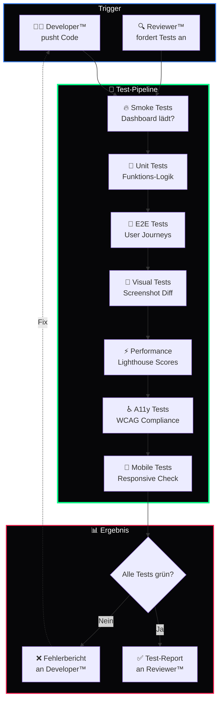

<div align="center">

# 🧪 DkZ Tester™

### *Der Qualitätssicherer des DEVKiTZ™ Ökosystems*

**Playwright E2E · Unit Tests · Visual Regression · Performance Validation**

---


---

*Teil des [DEVKiTZ™ Ökosystems](https://github.com/777/devkitz-ecosystem) · BMAD™ Methodik Agent #6*

</div>

---

## 📖 Übersicht

**DkZ Tester™** validiert jede Code-Änderung im DEVKiTZ™ Ökosystem durch automatisierte Tests. Von Smoke-Tests über Full Regression bis hin zu Visual Snapshots — der Tester™ stellt sicher, dass alle 132+ Module korrekt funktionieren, bevor Code in den `main`-Branch gelangt.

Als Playwright-Spezialist erstellt der Tester™ E2E-Tests, die das Dashboard in realen Browser-Szenarien durchspielen, und liefert HTML-Reports mit Screenshots und Performance-Metriken an das Team.

---

## 🔄 Test-Workflow im Ralph-Loop



---

## 📊 Input / Output Matrix

| Richtung | Typ | Beschreibung |
|:---------|:----|:-------------|
| 📥 Input | Code-Änderungen | Neue oder geänderte Module vom Developer™ |
| 📥 Input | Akzeptanzkriterien | Testbare Kriterien aus User Stories |
| 📥 Input | `data-testid` Attribute | Stabile Selektoren für Playwright |
| 📥 Input | Baseline-Screenshots | Referenz-Bilder für Visual Regression |
| 📤 Output | Test-Reports (HTML) | Detaillierte Ergebnisse mit Screenshots |
| 📤 Output | Coverage-Reports | Zeilen- und Branch-Coverage |
| 📤 Output | Performance-Metriken | Lighthouse Scores pro Modul |
| 📤 Output | Bug-Reports | Fehlerbeschreibung mit Reproduktionsschritten |

---

## 🤝 Interaktions-Matrix

| Agent | Interaktion | Beschreibung |
|:------|:------------|:-------------|
| 🎯 James™ | `Reporting` | Test-Ergebnisse an Guardian melden |
| 📋 DkZ PM™ | `Akzeptanz` | Tests aus Akzeptanzkriterien ableiten |
| 🏗️ DkZ Architekt™ | `Testbarkeit` | Modul-Design für Tests optimieren |
| 👨‍💻 DkZ Developer™ | `Bugs` | Fehler melden, Test-Hooks anfordern |
| 🔍 DkZ Reviewer™ | `Verifikation` | Coverage-Reports für Review-Gate |
| 📚 DkZ Dokumentar™ | `Reports` | Test-Ergebnisse für Wiki archivieren |

---

## 🧪 Playwright E2E Test — Beispiel

```javascript
// tests/dashboard.spec.js
import { test, expect } from '@playwright/test';

test.describe('DEVKiTZ™ Dashboard', () => {

  test.beforeEach(async ({ page }) => {
    await page.goto('/01_PROJECTS/01_dashboard/index.html');
  });

  test('Dashboard lädt korrekt', async ({ page }) => {
    // Smoke Test — Grundfunktionalität
    await expect(page).toHaveTitle(/DEVKiTZ/);
    await expect(page.locator('[data-testid="navbar"]')).toBeVisible();
    await expect(page.locator('[data-testid="module-grid"]')).toBeVisible();
  });

  test('Module sind navigierbar', async ({ page }) => {
    // E2E — Modul-Navigation
    const moduleCards = page.locator('[data-testid="module-card"]');
    await expect(moduleCards).toHaveCount({ minimum: 10 });

    await moduleCards.first().click();
    await expect(page).toHaveURL(/modules\//);
  });

  test('Dark Mode nutzt DkZ Farben', async ({ page }) => {
    // Visual — CSS Variables aktiv
    const bg = await page.evaluate(() =>
      getComputedStyle(document.body).getPropertyValue('--bg').trim()
    );
    expect(bg).toBe('#060608');
  });

  test('Kein console.error auf der Seite', async ({ page }) => {
    // Qualität — Keine JS-Fehler
    const errors = [];
    page.on('console', msg => {
      if (msg.type() === 'error') errors.push(msg.text());
    });
    await page.waitForLoadState('networkidle');
    expect(errors).toHaveLength(0);
  });

  test('Responsive Layout ab 320px', async ({ page }) => {
    // Mobile — Breakpoint-Test
    await page.setViewportSize({ width: 320, height: 568 });
    await expect(page.locator('[data-testid="navbar"]')).toBeVisible();
    await expect(page.locator('[data-testid="module-grid"]')).toBeVisible();
  });
});
```

---

## 📋 Test-Plan Template

| Test-Typ | Scope | Frequenz | Schwelle |
|:---------|:------|:---------|:---------|
| 🔥 Smoke | Dashboard Core | Jeder Push | 100% Pass |
| 🧩 Unit | Utility-Funktionen | Jeder Push | ≥ 80% Coverage |
| 🔗 E2E | User Journeys | Jeder PR | ≥ 90% Pass |
| 📸 Visual | Screenshots | Wöchentlich | < 0.1% Diff |
| ⚡ Performance | Lighthouse | Jeder PR | Score ≥ 90 |
| ♿ A11y | WCAG 2.1 AA | Jeder PR | 0 Violations |
| 📱 Mobile | 320px–1440px | Jeder PR | Kein Overflow |

---

## 📸 Screenshot-Archiv

Der Tester™ verwaltet das umfangreichste visuelle Archiv im DEVKiTZ™ Ökosystem:

| Metrik | Wert |
|:-------|:-----|
| Screenshots gesamt | 3.608+ |
| Baseline-Sets | Pro Modul |
| Diff-Schwelle | 0.1% |
| Format | PNG, 1920×1080 + 375×812 |
| Speicherort | `tests/screenshots/` |

---

## 🧠 Best Practices

- **Stabile Selektoren** — `data-testid` statt CSS-Klassen oder Textinhalt
- **Unabhängige Tests** — Kein Test hängt von einem anderen ab
- **Deterministisch** — Gleicher Input = Gleicher Output, immer
- **Screenshots bei Fehlern** — Automatisch gespeichert für Debugging
- **CI-Integration** — Tests laufen in GitHub Actions auf jedem PR
- **Flaky Test = Bug** — Instabile Tests werden sofort repariert

---

<div align="center">

---

**🧪 DkZ Tester™** · Teil der [BMAD™ Methodik](https://github.com/777/devkitz-ecosystem)

Gebaut mit 🖤 von **DEVKiTZ™** · `#060608` · Keine Frameworks. Kein Kompromiss.


</div>
