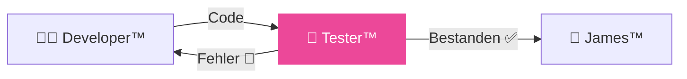

# 🧪 DkZ Tester™ — Tests + Validierung

> **Team:** `dkz-tester` · **Rolle:** Tester · **Phase:** Verify

---

## Verantwortung

DkZ Tester™ **validiert** den Code. Er testet Funktionalität, Browser-Kompatibilität, Responsive Design und Edge Cases. Phase 4 (VERIFY) im Ralph-Loop™.

## Aufgaben

| Aufgabe | Beschreibung |
|:--------|:-------------|
| 🧪 Funktionstests | Alle Features gegen PRD testen |
| 📱 Responsive | Mobile, Tablet, Desktop prüfen |
| 🌐 Browser | Chrome, Firefox, Safari, Edge |
| ⚡ Performance | Ladezeit, Memory, CPU |
| 🛡️ Edge Cases | Fehlerbehandlung, leere Daten, Grenzen |

## Templates

- [Test-Plan Template](./test-plan-template.md)
- [Validierungsregeln](./validation-rules.md)

## Interaktion

