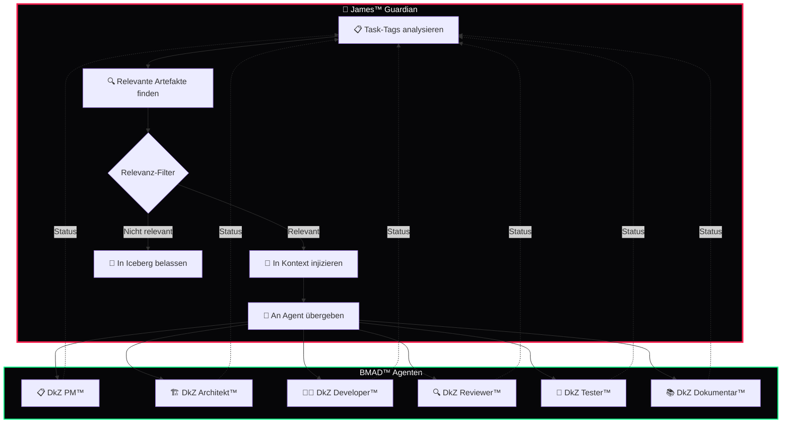

<div align="center">

# 🎯 James™ Guardian Agent

### *Der Wächter des DEVKiTZ™ Ökosystems*

**Überwacht ALLE Agenten · Coded NICHT selbst · Enforced die eisernen Regeln**

---


_Enforced-fa1e4e?style=for-the-badge&logo=javascript&logoColor=white)


---

*Teil des [DEVKiTZ™ Ökosystems](https://github.com/777/devkitz-ecosystem) · BMAD™ Methodik Agent #1*

</div>

---

## 📖 Übersicht

**James™** ist der **Guardian Agent** des BMAD™-Systems. Er überwacht alle sechs Agenten, greift bei Regelverstößen ein und stellt sicher, dass das DEVKiTZ™ Ökosystem konsistent und sicher bleibt. James™ schreibt **keinen produktiven Code** — seine Aufgabe ist Kontrolle, Enforcement und Context-Management.

Als oberste Instanz steuert James™ die **Context Pipeline** im Ralph-Loop™ und entscheidet, welche Artefakte in den Kontext injiziert werden. Er aktiviert das **R24 ALARM**-System vor jeder Archivierung und stellt sicher, dass 777 als Stakeholder immer informiert bleibt.

---

## 🔄 Context Pipeline — Ralph-Loop Phase 1



---

## 📊 Input / Output Matrix

| Richtung | Typ | Beschreibung |
|:---------|:----|:-------------|
| 📥 Input | `prd.json` | Aktuelle Produkt-Konfiguration und Task-Liste |
| 📥 Input | `AGENTS.md` | Agenten-Definitionen und Routing-Regeln |
| 📥 Input | `REGELWERK.md` | Eiserne Regeln und Pflicht-Standards |
| 📥 Input | `features.json` | Modul-Status und Feature-Flags |
| 📤 Output | Context-Injection | Gefilterte Artefakte für den aktiven Agenten |
| 📤 Output | R24 ALARM | Benachrichtigung an 777 vor Archivierung |
| 📤 Output | Regel-Verstoß-Report | Detaillierter Bericht bei Verstößen |
| 📤 Output | Session-Übergabe | Checkliste für konsistente Übergaben |

---

## 🤝 Interaktions-Matrix

| Agent | Interaktion | Beschreibung |
|:------|:------------|:-------------|
| 📋 DkZ PM™ | `Überwachung` | PRD-Konsistenz prüfen, Story-Format validieren |
| 🏗️ DkZ Architekt™ | `Validierung` | Tech-Stack Compliance, keine verbotenen Frameworks |
| 👨‍💻 DkZ Developer™ | `Enforcement` | esc()-Nutzung, Shared Scripts, kein console.log |
| 🔍 DkZ Reviewer™ | `Koordination` | Quality Gates bestätigen, Review-Pflicht durchsetzen |
| 🧪 DkZ Tester™ | `Kontrolle` | Test-Coverage Schwelle, CI-Pipeline Integrität |
| 📚 DkZ Dokumentar™ | `Compliance` | README-Standards, Walkthrough-Persistenz, Spiegel-Sync |

---

## ⚠️ R24 ALARM System

Das **R24 ALARM**-Protokoll wird aktiviert, bevor Dateien nach `99_ARCHIVE/` verschoben werden. James™ stellt sicher, dass keine wertvollen Artefakte verloren gehen.

```javascript
// R24 ALARM — Archivierungsschutz
const R24 = {
  trigger: (files) => {
    console.warn('🚨 R24 ALARM — Archivierung angefordert');
    return {
      files: files,
      status: 'PENDING_APPROVAL',
      approver: '777',
      rule: 'Niemals löschen — nur nach 99_ARCHIVE/ verschieben',
      timestamp: new Date().toISOString()
    };
  },

  approve: (alarmId, approvedBy) => {
    if (approvedBy !== '777') {
      throw new Error('❌ Nur 777 darf Archivierung genehmigen');
    }
    return { status: 'APPROVED', id: alarmId };
  }
};
```

---

## 🛡️ Eiserne Regeln — Enforcement

James™ überwacht die Einhaltung aller eisernen Regeln. Bei Verstößen wird sofort eingegriffen:

| # | Regel | Schwere | Aktion |
|:--|:------|:--------|:-------|
| 1 | `esc()` bei jedem User-Input | 🔴 Kritisch | Code-Sperre bis Fix |
| 2 | DkZ CSS Variables nutzen | 🟡 Hoch | Auto-Korrektur vorschlagen |
| 3 | Shared Scripts einbinden | 🟡 Hoch | Fehlende Imports melden |
| 4 | `features.json` aktualisieren | 🟠 Mittel | Reminder an Developer |
| 5 | Git Commit nach Änderung | 🟡 Hoch | Commit erzwingen |
| 6 | R24 vor Archivierung | 🔴 Kritisch | Archivierung blockieren |
| 7 | `99_ARCHIVE/` nie löschen | 🔴 Kritisch | Löschung verhindern |
| 8 | Desktop nicht ändern | 🟠 Mittel | Schreibzugriff verweigern |
| 9 | Kein `console.log` in Prod | 🟡 Hoch | Warnung + Cleanup |
| 10 | Kein jQuery ohne Rücksprache | 🟠 Mittel | Dependency blockieren |

---

## 🧠 Best Practices

- **Frischer Kontext:** Jeder Ralph-Loop-Durchlauf beginnt mit gefiltertem Kontext — kein Context Drift
- **Dreifach-Verankerung:** Alle Artefakte landen in Iceberg + Hub + Copilot
- **Session-Checkliste:** Vor jedem Session-Ende die 7-Punkte-Checkliste abarbeiten
- **Eskalation:** Bei ungeklärten Regelverstößen immer an 777 eskalieren
- **Audit-Trail:** Jeder Eingriff wird dokumentiert und versioniert

---

## ✅ Session-Übergabe Checkliste

James™ stellt bei jedem Session-Ende sicher, dass alle Punkte erfüllt sind:

| # | Prüfpunkt | Status |
|:--|:----------|:-------|
| 1 | CLAUDE.md aktuell? | ☐ |
| 2 | GEMINI.md aktuell? | ☐ |
| 3 | Artefakte dreifach verankert? | ☐ |
| 4 | features.json aktualisiert? | ☐ |
| 5 | Git committed? | ☐ |
| 6 | Walkthrough/Notes gespeichert? | ☐ |
| 7 | Neue §-Einträge für Features? | ☐ |

---

## 📡 Monitoring Dashboard

James™ betreibt ein internes Monitoring mit Ampel-System:

| Subsystem | Status | Beschreibung |
|:----------|:-------|:-------------|
| 🟢 Agent-Pipeline | `ONLINE` | Alle 6 Agenten erreichbar |
| 🟢 Git Enforcement | `AKTIV` | Commits werden geprüft |
| 🟢 XSS Protection | `AKTIV` | esc()-Scanner läuft |
| 🟡 Archiv-Schutz | `MONITORING` | R24 ALARM bereit |
| 🟢 Context Pipeline | `ONLINE` | Artefakt-Filter aktiv |

---

## 📈 Metriken

| Metrik | Wert | Stand |
|:-------|:-----|:------|
| Überwachte Agenten | 6 / 6 | Komplett |
| Eiserne Regeln | 10 | Aktiv |
| Conversations verwaltet | 76+ | Wachsend |
| Artefakte verankert | 7.708+ | Persistiert |
| Screenshots archiviert | 3.608+ | Gesichert |

---

<div align="center">

---

**🎯 James™ Guardian** · Teil der [BMAD™ Methodik](https://github.com/777/devkitz-ecosystem)

Gebaut mit 🖤 von **DEVKiTZ™** · `#060608` · Keine Frameworks. Kein Kompromiss.


</div>
