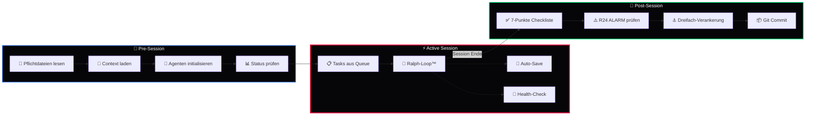
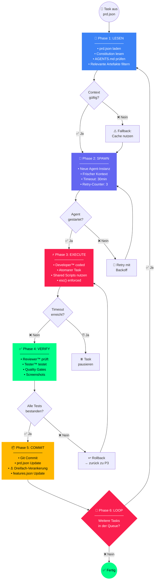

<div align="center">

# 🔄 Workflows

### Session-Management, Übergabe & Ralph-Loop™ Orchestrierung


---

*Session-Workflows des [BMAD™ Frameworks](https://github.com/D-VKITZ/bmad-framework) · DEVKiTZ™ Ökosystem*

</div>

---

## 📖 Übersicht

Der **Workflows-Ordner** enthält die drei zentralen Ablauf-Definitionen des BMAD™ Frameworks: den **Startup-Workflow** (Session-Beginn), den **Handoff-Workflow** (Session-Übergabe) und das **Ralph-Loop™ Diagramm** (Task-Execution). Zusammen bilden sie das Rückgrat für konsistente, reproduzierbare Entwicklungs-Sessions — ohne Context-Drift und ohne Wissensverlust.

---

## 📋 Workflow-Übersicht

| Workflow | Datei | Trigger | Phase | Beschreibung |
|:---------|:------|:--------|:------|:-------------|
| 🚀 **Startup** | `startup.md` | Session-Beginn | Pre-Session | Pflichtdateien lesen, Context laden, Agenten init |
| 🤝 **Handoff** | `handoff.md` | Session-Ende | Post-Session | 7-Punkte Checkliste, R24, Dreifach-Verankerung |
| 🔄 **Ralph-Loop** | `ralph-loop-diagram.md` | Jeder Task | Active | 6 Phasen, Entscheidungspunkte, Rollback |

---

## 🔄 Workflow-Lifecycle



---

## 🚀 startup.md — Session-Start

### Pflichtdateien-Kaskade

Beim Start jeder DEVKiTZ™-Session müssen diese Dateien in **exakter Reihenfolge** gelesen werden:

| Priorität | Datei | Pfad | Inhalt |
|:----------|:------|:-----|:-------|
| 1 | `CLAUDE.md` | `C:\DEVKiTZ\CLAUDE.md` | Regelwerk für Claude-basierte Agenten |
| 2 | `GEMINI.md` | `C:\DEVKiTZ\GEMINI.md` | Gedächtnis + Regelwerk für Gemini |
| 3 | `REGELWERK.md` | `C:\DEVKiTZ\REGELWERK.md` | Eiserne Regeln + Standards |
| 4 | `BLAUPAUSE.md` | `01_PROJECTS\01_dashboard\BLAUPAUSE.md` | Dashboard-Architektur |

### 5-Schritt Startup-Sequenz

```javascript
// Session-Start Protokoll
async function startSession() {
  // Schritt 1: Pflichtdateien laden
  const claude = await readFile('C:/DEVKiTZ/CLAUDE.md');
  const gemini = await readFile('C:/DEVKiTZ/GEMINI.md');
  const regelwerk = await readFile('C:/DEVKiTZ/REGELWERK.md');
  const blaupause = await readFile('01_PROJECTS/01_dashboard/BLAUPAUSE.md');

  // Schritt 2: Agenten-Registry prüfen
  const agents = await loadJSON('AGENTS.md');
  
  // Schritt 3: Letzte Session-Artefakte laden
  const lastSession = await iceberg.getLatest('session');
  
  // Schritt 4: Offene Tasks aus prd.json
  const prd = await loadJSON('prd.json');
  const openTasks = prd.tasks.filter(t => t.status !== 'completed');
  
  // Schritt 5: Health-Check aller Systeme
  const health = await checkAllSystems();
  
  return {
    context: { claude, gemini, regelwerk, blaupause },
    agents,
    openTasks,
    health
  };
}
```

---

## 🤝 handoff.md — Session-Übergabe

### 7-Punkte Checkliste

Bei **jedem** Session-Ende muss diese Checkliste abgearbeitet werden. James™ überwacht die Einhaltung.

| # | Prüfpunkt | Verantwortlich | Beschreibung |
|:--|:----------|:---------------|:-------------|
| 1 | ☐ `CLAUDE.md` aktuell? | James™ | Neue Regeln, Erkenntnisse eingetragen? |
| 2 | ☐ `GEMINI.md` aktuell? | James™ | Gedächtnis ergänzt? |
| 3 | ☐ Artefakte dreifach verankert? | Dokumentar™ | Iceberg + Hub + Copilot |
| 4 | ☐ `features.json` aktualisiert? | Developer™ | Neue/geänderte Module registriert? |
| 5 | ☐ Git committed? | Developer™ | Conventional Commit erstellt? |
| 6 | ☐ Walkthrough/Notes gespeichert? | Dokumentar™ | Zusammenfassung der Arbeit |
| 7 | ☐ Neue §-Einträge für Features? | PM™ | Neue Regeln dokumentiert? |

### R24 ALARM Protokoll

Vor jeder Verschiebung nach `99_ARCHIVE/`:

```
1. 🚨 R24 ALARM aktivieren
2. 📋 Liste der betroffenen Dateien erstellen
3. 👤 777 informieren und Bestätigung abwarten
4. ✅ Erst nach expliziter Genehmigung verschieben
5. ⚓ Dreifach-Verankerung der archivierten Artefakte
6. 📝 Walkthrough der Archivierung erstellen
```

---

## 🔄 ralph-loop-diagram.md — Ralph-Loop™

### 6-Phasen mit Entscheidungspunkten



---

## 🏥 Background-Loops

Während der aktiven Session laufen 8 Background-Loops parallel:

| # | Loop | Intervall | Funktion | Ampel |
|:--|:-----|:----------|:---------|:------|
| 1 | 🔄 Ralph-Loop | Pro Task | Task-Execution Pipeline | 🟢 |
| 2 | 💡 Copilot Suggest | 30s | Kontextbezogene Vorschläge | 🟢 |
| 3 | 💾 Auto-Save | 60s | Änderungen automatisch speichern | 🟢 |
| 4 | 📦 Backup | 5min | Incremental Backup → Iceberg™ | 🟢 |
| 5 | 🏥 Health | 30s | System-Health aller Komponenten | 🟢 |
| 6 | 🔄 Update | 10min | Feature-Updates + Sync prüfen | 🟢 |
| 7 | 🎫 Triage | 5min | Issue-Triage + Auto-Labeling | 🟢 |
| 8 | 🤝 Dual-Agent | Realtime | Dual-Agent Koordination | 🟢 |

---

## 🛡️ Recovery & Rollback

| Szenario | Recovery-Strategie | Kommando |
|:---------|:-------------------|:---------|
| Context Drift | Frischen SPAWN erzwingen | Ralph-Loop Phase 2 |
| Git-Konflikt | Rebase + Retry | `git rebase --continue` |
| Agent-Timeout | Task pausieren, nächsten starten | Orchestrator Auto |
| Regelverstoß | Sofort-Stopp, James™ Alert | R24 ALARM |
| Datenverlust | Iceberg™ Restore | `iceberg restore --latest` |
| Session-Crash | Letzte Auto-Save wiederherstellen | Auto-Recovery |

---

## 🧠 Best Practices

- ✅ **Immer** mit Startup-Workflow beginnen — keine Abkürzungen
- ✅ **Frischer Kontext** pro Ralph-Loop — niemals alten State wiederverwenden
- ✅ **7-Punkte Checkliste** bei Session-Ende — kein Punkt auslassen
- ✅ **R24 vor Archivierung** — 777 muss explizit genehmigen
- ✅ **Dreifach-Verankerung** für alle Artefakte

### ❌ Anti-Patterns

- ❌ Session starten ohne Pflichtdateien zu lesen
- ❌ Tasks ohne prd.json-Eintrag ausführen
- ❌ Context aus vorheriger Session weiterverwenden
- ❌ Archivierung ohne R24 ALARM
- ❌ Handoff ohne Git Commit

---

<div align="center">

---

**🔄 Workflows** · Teil des [BMAD™ Frameworks](https://github.com/D-VKITZ/bmad-framework)

Gebaut mit 🖤 von **DEVKiTZ™** · `#060608` · Konsistente Sessions. Kein Wissensverlust.


</div>
