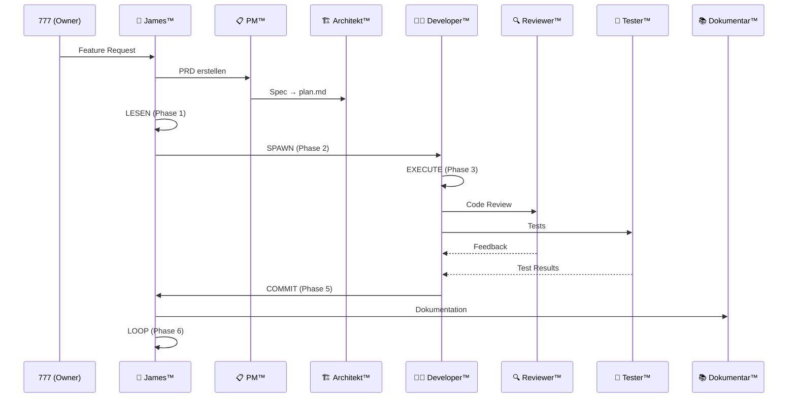

# 🔄 Workflows

## Session-Start

1. **Pflicht-Dateien lesen:** CLAUDE.md → GEMINI.md → REGELWERK.md → BLAUPAUSE.md
2. **Context laden:** Relevante Artefakte aus Iceberg
3. **Task-Queue prüfen:** prd.json öffnen → nächsten Task identifizieren
4. **Ralph-Loop starten:** Phase 1 (LESEN) beginnen

## Session-Übergabe

1. ✅ CLAUDE.md aktuell?
2. ✅ GEMINI.md aktuell?
3. ✅ Artefakte dreifach verankert? (Iceberg + Hub + Copilot)
4. ✅ features.json aktualisiert?
5. ✅ Git committed?
6. ✅ Walkthrough/Notes gespeichert?
7. ✅ Neue §-Einträge für neue Features?

## Ralph-Loop™ Diagram

